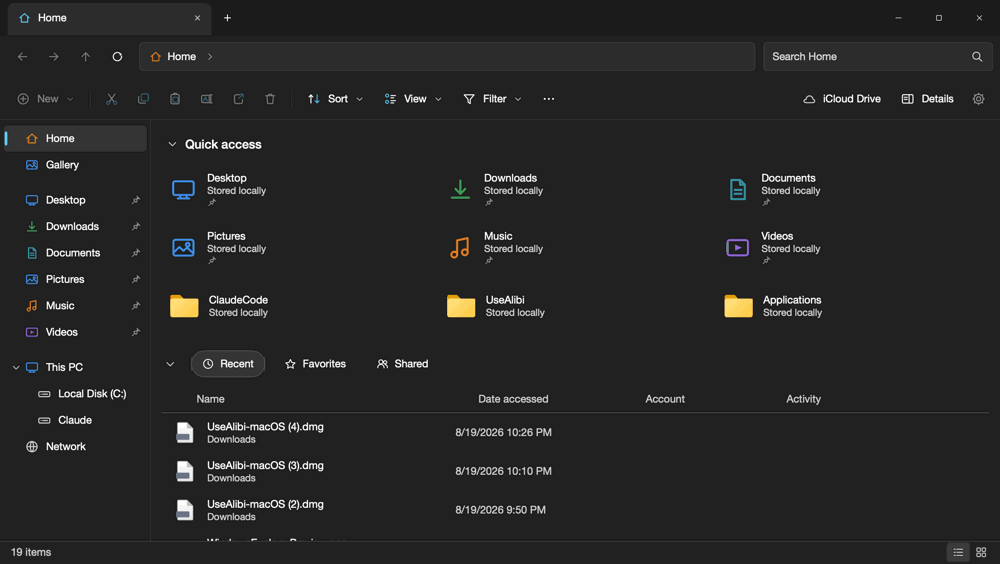
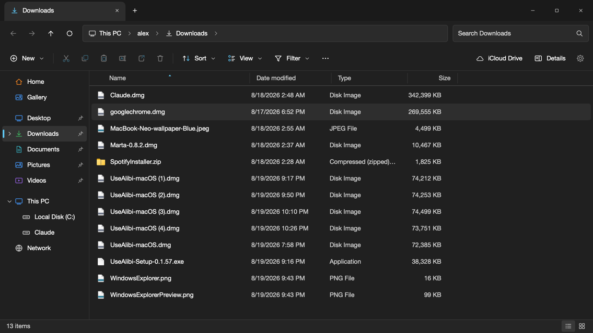
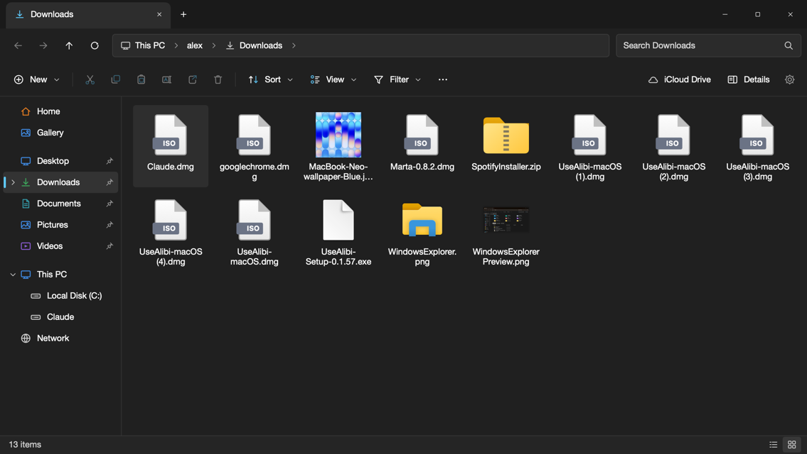
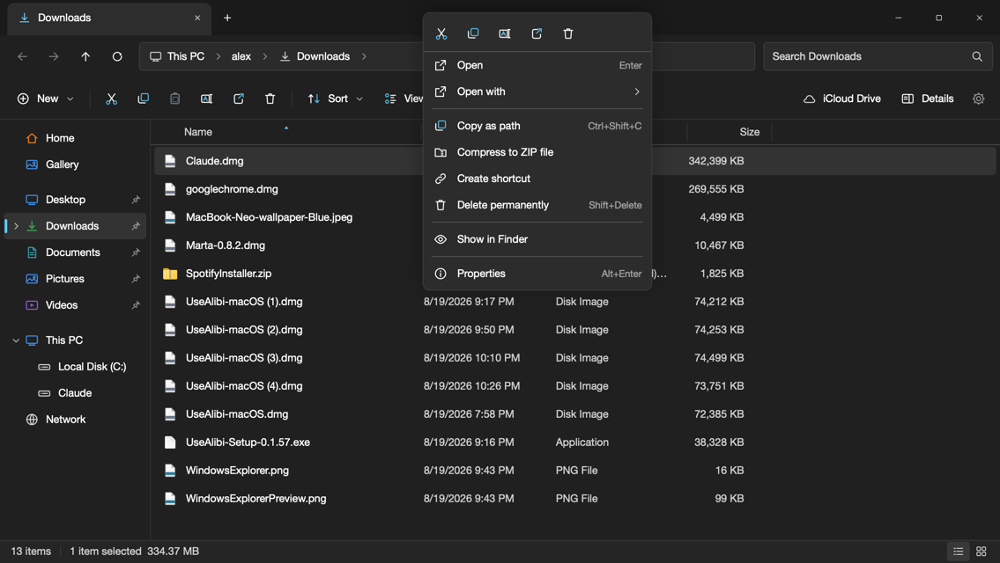
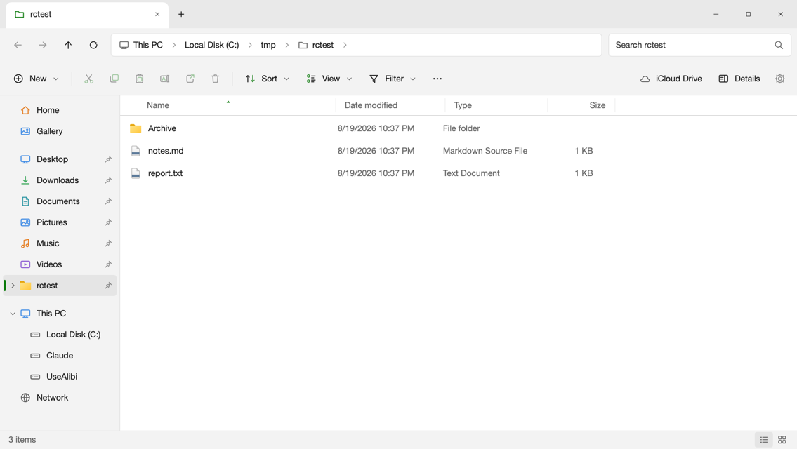
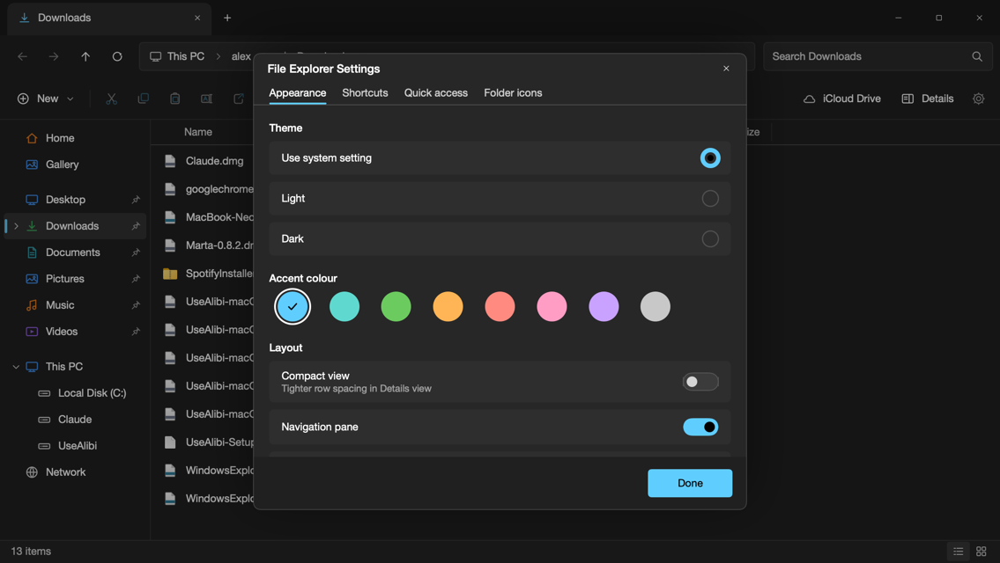

<div align="center">


# File Explorer for Mac

**The Windows 11 File Explorer, rebuilt natively for macOS.**

Same layout, same Fluent iconography, same keyboard shortcuts, driving the real macOS filesystem.

[](https://www.apple.com/macos/)
[](https://swift.org)
[](#build)
[](#tests)
[](LICENSE)



</div>

## Why

I wanted Windows Explorer on my Mac. Not "a file manager with Windows-ish styling", but the actual thing: the tab strip, the command bar, the breadcrumb address bar, `Ctrl+C` / `Ctrl+V` / `F2` / `Alt+Left`, and the Fluent icons.

So I built it. No Electron, no dependencies, no package manager. One `swiftc` invocation produces a 3 MB native app.

## Highlights

|  |  |
|---|---|
| **Pixel-faithful chrome** | Tab strip with Windows caption buttons drawn where the traffic lights normally go, breadcrumb address bar with sibling drop-downs, command bar, status bar. Colours come from the WinUI 3 dark and light palettes. |
| **Redrawn Fluent icons** | Segoe Fluent Icons isn't licensed onto macOS, so every glyph is redrawn as vector geometry on Windows' own 16pt design grid, including the two-tone accent treatment on cut, copy, paste, rename, share, sort and view. |
| **Real Windows shortcuts** | Bound to both `Ctrl` (Windows) and `Cmd` (Mac reflex), and every one of them re-mappable from Settings. |
| **Eight view modes** | Icon grids with live Quick Look thumbnails, List that flows into columns, Details with sortable resizable columns, Tiles, Content. |
| **It actually does the work** | Copy, cut and move, paste with `- Copy` conflict naming, rename, ZIP, shortcuts, Recycle Bin and permanent delete, all with undo and redo. Drag and drop works inside the app, onto sidebar folders and Quick access tiles, and to and from Finder, with the drop target lighting up as you hover it. |

<div align="center">
 
 
</div>

## Download

Grab the latest build from [Releases](https://github.com/gmazaratti/windows-explorer-mac/releases/latest). Universal binary, Apple Silicon and Intel, macOS 14 or newer.

The app is ad-hoc signed but **not notarized**, because notarization requires a paid Apple Developer account. macOS will therefore refuse to open it the first time. Either:

- **System Settings > Privacy & Security**, scroll down to the message about File Explorer, and click **Open Anyway**, or
- clear the quarantine flag yourself:

  ```bash
  xattr -dr com.apple.quarantine "/Applications/File Explorer.app"
  ```

If you would rather not do either, build it from source. That takes one command and produces a binary macOS trusts, because it never came from the internet.

## Build

Requires only the Xcode Command Line Tools. No Xcode project, no Node, no Homebrew.

```bash
git clone https://github.com/gmazaratti/windows-explorer-mac.git
cd windows-explorer-mac
./build.sh
open "build/File Explorer.app"
```

`./build.sh --universal` produces an Apple Silicon and Intel binary, which is what the releases ship.

To keep it around:

```bash
cp -R "build/File Explorer.app" /Applications/
```

> macOS asks permission the first time the app reads Desktop, Documents, Downloads or a removable volume. Until you allow it, those folders list as empty. That is macOS, not the app.

## Keyboard shortcuts

Every shortcut works with **`Ctrl`** (as on Windows) *and* **`Cmd`** (as Mac muscle memory expects). `Alt` means `Option`.

<table>
<tr><td valign="top">

**Clipboard and files**

| Shortcut | Action |
|---|---|
| `Ctrl+C` | Copy |
| `Ctrl+X` | Cut |
| `Ctrl+V` | Paste |
| `Ctrl+Shift+V` | Paste shortcut |
| `Ctrl+Shift+C` | Copy as path |
| `Ctrl+Z` / `Ctrl+Y` | Undo, redo |
| `F2` | Rename |
| `Delete` | Recycle Bin |
| `Shift+Delete` | Delete permanently |
| `Ctrl+Shift+N` | New folder |
| `Enter` | Open |
| `Alt+Enter` | Properties |

</td><td valign="top">

**Navigation**

| Shortcut | Action |
|---|---|
| `Alt+Left` / `Alt+Right` | Back, forward |
| `Alt+Up` | Up one level |
| `Backspace` | Back |
| `F5` / `Ctrl+R` | Refresh |
| `Ctrl+L` / `Alt+D` / `F4` | Address bar |
| `Ctrl+F` / `F3` | Search |
| `Ctrl+D` | Show desktop (Win+D) |
| `Ctrl+Shift+D` | Go to Desktop folder |
| `Ctrl+Shift+H` | Go Home |
| `Ctrl+Shift+J` | Go to Downloads |
| Type letters | Type-ahead jump |

</td><td valign="top">

**View, tabs and windows**

| Shortcut | Action |
|---|---|
| `Ctrl+Shift+1` to `8` | The eight view modes |
| `Ctrl+Scroll` | Cycle icon sizes |
| `Ctrl+T` / `Ctrl+W` | New tab, close tab |
| `Ctrl+Tab` | Next tab |
| `Ctrl+1` to `9` | Jump to tab |
| `Ctrl+N` | New window |
| `Ctrl+A` | Select all |
| `Alt+P` / `Alt+Shift+P` | Preview, details pane |
| `Ctrl+H` | Hidden items |
| `Ctrl+,` | Settings |

</td></tr>
</table>

`Ctrl+D` is Windows' `Win+D`: it hides every app so the desktop itself is showing, and puts them back when you press it again.

## Settings



The gear at the right end of the command bar, also in the `...` menu, the background right-click menu, and on `Ctrl+,`.

- **Appearance.** System, Light or Dark, eight accent colours, and toggles for compact view, the three panes, item check boxes, extensions and hidden items.
- **Shortcuts.** Re-map any command. Click a shortcut, press the keys. If the combination is taken it is moved off the other command and you are told which. Per-command and global reset.
- **Quick access.** Everything pinned to the sidebar. Unpin any of it, including the six Windows defaults, restore what you unpinned, add folders.
- **Folder icons.** The folders you have customised, with a reset for each.

**Pinning.** Right-click any folder, in the list or the sidebar, then choose *Pin to Quick access*.

**Custom folder icons.** Right-click a folder and choose *Change icon*, then pick a Fluent glyph and a colour, or tint the standard folder. It applies in the file list, the sidebar and the Home tiles.

<br clear="right">

## How the icons were made

Windows draws its command bar with **Segoe Fluent Icons**, a font that ships with Windows and isn't available on macOS. Copying the font wasn't an option, so the glyphs are reconstructed instead.

Each icon is authored as a string in a small path language, on the same 16x16 grid Fluent uses:

```swift
.paste:  ("R 3.4 3.0 9.2 10.6 1.5 M6.2 3.0 V2.4 C6.2 1.9 6.5 1.6 7 1.6 H9 C9.5 1.6 9.8 1.9 9.8 2.4 V3.0", "")
.filter: ("M2.4 3.4 H13.6 L9.2 8.6 V13.4 L6.8 11.8 V8.6 Z", "")
```

`M/L/H/V/C/Q/Z` are the usual SVG commands, `O` adds a circle, `R` a rounded rect, `K` an arc. A parser of about 60 lines turns them into SwiftUI `Path`s rendered in a `Canvas`. A second, optional layer per icon carries the accent-coloured part: the blue rings on the scissors, the blue sheet inside the clipboard. That layer is what makes the command bar read as Windows rather than as generic line art.

The palette was taken from the WinUI 3 design tokens and cross-checked by sampling pixels out of a real Windows 11 screenshot.

## Architecture

```
Sources/
  Theme.swift          WinUI 3 colour system, metrics, type ramp
  Glyphs.swift         Fluent icon set: path mini-language and renderer
  FileIcons.swift      Folder and file-type artwork, Quick Look thumbnails
  Model.swift          FileItem, Windows metadata formatting, known folders
  Explorer.swift       Tabs, history, selection, clipboard, file ops, undo, search
  Settings.swift       Re-mappable shortcuts, theme, folder icons, pinning
  Controls.swift       Win11 buttons, flyout menus, AppKit-backed text fields
  Chrome.swift         Title bar, address bar, command bar
  Sidebar.swift        Navigation pane and drop handling
  FileList.swift       Details, icons, list, tiles, content, right-click routing
  HomeView.swift       Quick access and Recent
  Panes.swift          Status bar, details pane, preview pane
  Dialogs.swift        Properties, delete confirmation, errors
  SettingsDialog.swift Settings and folder-icon dialogs
  ContextMenus.swift   Right-click menus
  ContentView.swift    Root layout, flyout and dialog hosting
  App.swift            Window setup, key bindings, menu bar
  SelfTest.swift       End-to-end checks
Tools/
  MakeIcon.swift       Draws the app icon, one render per icon-set size
  release.sh           Signs, notarizes and staples a release build
build.sh               Compiles and assembles the .app bundle
```

Two decisions worth calling out:

- **Right-click routing.** Context-menu targets register an invisible marker view, and a window-level monitor picks the smallest target under the pointer, falling back to the file-area background. Fighting AppKit's hit-testing instead would have swallowed the left clicks SwiftUI needs for selection and drag and drop.
- **Shortcuts match on key code, not character.** `Shift+3` reports `#`, not `3`, so matching on characters silently breaks every `Ctrl+Shift+<digit>` binding.

## Tests

```bash
WINEXP_SELFTEST=1 "build/File Explorer.app/Contents/MacOS/FileExplorer"
```

Creates a scratch folder and drives the **real** key handler and file operations through copy, cut, paste, undo, rename, delete, restore, navigation, tabs, view modes, type-ahead, sorting, search, shortcut re-mapping, pinning, folder icons and right-click routing. **49 checks.**

Development helpers: `WINEXP_START=<path>` opens at a folder, `WINEXP_SNAPSHOT=<file.png>` writes a screenshot of the window, and `WINEXP_TEST=menu:context|dialog:settings|dialog:about|drop` opens a menu or dialog, or forces every drop target to light up, for inspection.

## Deliberate differences

- **Extensions are shown by default.** Windows hides known ones. The toggle is in `View > Show > File name extensions`.
- **The Recycle Bin is the macOS Trash**, so deleted items land where the rest of the system expects them.
- **Drives.** The boot volume is labelled `Local Disk (C:)`, and other mounted volumes appear under This PC by their own names.
- **"Account disconnected"** reports what is actually on the Mac. It reads *iCloud Drive* or *OneDrive* when either is present, and *Account disconnected* when neither is.
- Rubber-band (marquee) selection isn't implemented. Use `Shift` or `Ctrl` click.

## Credits

**Created by [Alex Degryse](https://www.linkedin.com/in/alexdegryse)**, [linkedin.com/in/alexdegryse](https://www.linkedin.com/in/alexdegryse)

Not affiliated with or endorsed by Microsoft. Windows, Windows 11, File Explorer, Segoe and Fluent are trademarks of Microsoft Corporation. All artwork in this project is original: the app icon is drawn from scratch by `Tools/MakeIcon.swift`, and the in-app iconography is original vector work laid out on Fluent's design grid.

## License

[MIT](LICENSE) (c) Alex Degryse
